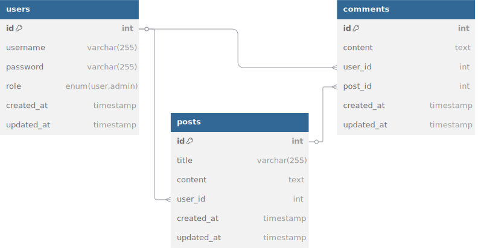

# Проєктування бази даних

## Модель бізнес-об'єктів 
@startuml
entity users  #8e44ad
entity users.id          #a569bd
entity users.username    #a569bd
entity users.password    #a569bd
entity users.role        #a569bd
entity users.created_at  #a569bd

entity posts  #cb4335
entity posts.id           #ec7063 
entity posts.title        #ec7063 
entity posts.content      #ec7063 
entity posts.user_id      #ec7063 
entity posts.created_at   #ec7063 
entity posts.updated_at   #ec7063 

entity comments #0e6251
entity comments.id         #117864
entity comments.content    #117864
entity comments.user_id    #117864
entity comments.post_id    #117864
entity comments.created_at #117864

users    *-u- users.id
users    *-u- users.username
users    *-u- users.password
users    *-u- users.role
users    *-u- users.created_at

posts    *-d- posts.id
posts    *-d- posts.title
posts    *-d- posts.content
posts    *-d- posts.user_id
posts    *-d- posts.created_at
posts    *-d- posts.updated_at

comments *-d- comments.id
comments *-d- comments.content
comments *-d- comments.user_id
comments *-d- comments.post_id
comments *-d- comments.created_at

users "1,1" -r- "0, *" posts     : user_id
users "1,1" -d- "0, *" comments  : user_id
posts "1,1" -l- "0, *" comments  : post_id
@enduml

## ER-модель
@startuml

skinparam linetype ortho

entity User {
  *id : INT <<PK>>
  --
  username : VARCHAR(255) <<UNIQUE>>
  password : VARCHAR(255)
  role     : ENUM('user','admin') [default='user']
  created_at : TIMESTAMP [default=NOW]
  updated_at  : TIMESTAMP [auto-update]
}

entity Post {
  *id : INT <<PK>>
  --
  title       : VARCHAR(255)
  content     : TEXT
  user_id     : INT <<FK>>
  created_at  : TIMESTAMP [default=NOW]
  updated_at  : TIMESTAMP [auto-update]

}

entity Comment {
  *id : INT <<PK>>
  --
  content     : TEXT
  user_id     : INT <<FK>>
  post_id     : INT <<FK>>
  created_at  : TIMESTAMP [default=NOW]
  updated_at  : TIMESTAMP [auto-update]
}

User ||--o{ Post : "user_id"
User ||--o{ Comment : "user_id"
Post ||--o{ Comment : "post_id"
@enduml

## Реляційна схема

