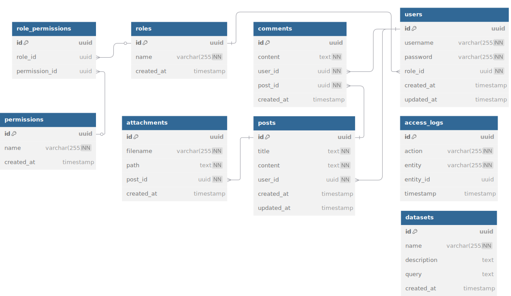

# Проєктування бази даних

## Модель бізнес-об'єктів 
@startuml
' ===== Existing Entities =====

entity users  #8e44ad
entity users.id          #a569bd
entity users.username    #a569bd
entity users.password    #a569bd
entity users.role_id     #a569bd
entity users.updated_at  #a569bd
entity users.created_at  #a569bd

entity posts  #cb4335
entity posts.id           #ec7063 
entity posts.title        #ec7063 
entity posts.content      #ec7063 
entity posts.user_id      #ec7063 
entity posts.created_at   #ec7063 
entity posts.updated_at   #ec7063 

entity comments #0e6251
entity comments.id         #117864
entity comments.content    #117864
entity comments.user_id    #117864
entity comments.post_id    #117864
entity comments.created_at #117864

' ===== New Entities =====

entity roles #2e86c1
entity roles.id         #5dade2
entity roles.name       #5dade2
entity roles.created_at #5dade2

entity permissions #148f77
entity permissions.id         #45b39d
entity permissions.name       #45b39d
entity permissions.created_at #45b39d

entity role_permissions #7d6608
entity role_permissions.id       #b7950b
entity role_permissions.role_id       #b7950b
entity role_permissions.permission_id #b7950b

entity attachments #6c3483
entity attachments.id         #a569bd
entity attachments.filename   #a569bd
entity attachments.path       #a569bd
entity attachments.post_id    #a569bd
entity attachments.created_at #a569bd

entity datasets #f39c12
entity datasets.id          #f7dc6f
entity datasets.name        #f7dc6f
entity datasets.description #f7dc6f
entity datasets.query        #f7dc6f
entity datasets.created_at  #f7dc6f

entity access_logs #566573
entity access_logs.id         #85929e
entity access_logs.action     #85929e
entity access_logs.entity     #85929e
entity access_logs.entity_id  #85929e
entity access_logs.timestamp  #85929e

' ===== Attribute Links =====

users    *-u- users.id
users    *-u- users.username
users    *-u- users.password
users    *-u- users.role_id
users    *-u- users.updated_at
users    *-u- users.created_at

posts    *-d- posts.id
posts    *-d- posts.title
posts    *-d- posts.content
posts    *-d- posts.user_id
posts    *-d- posts.created_at
posts    *-d- posts.updated_at

comments *-d- comments.id
comments *-d- comments.content
comments *-d- comments.user_id
comments *-d- comments.post_id
comments *-d- comments.created_at

roles *-d- roles.id
roles *-d- roles.name
roles *-d- roles.created_at

permissions *-d- permissions.id
permissions *-d- permissions.name
permissions *-d- permissions.created_at

role_permissions *-u- role_permissions.id
role_permissions *-u- role_permissions.role_id
role_permissions *-u- role_permissions.permission_id

attachments *-d- attachments.id
attachments *-d- attachments.filename
attachments *-d- attachments.path
attachments *-d- attachments.post_id
attachments *-d- attachments.created_at

datasets    *-u- datasets.id
datasets    *-u- datasets.name
datasets    *-u- datasets.description
datasets    *-u- datasets.query
datasets    *-u- datasets.created_at

access_logs *-u- access_logs.id
access_logs *-u- access_logs.action
access_logs *-u- access_logs.entity
access_logs *-u- access_logs.entity_id
access_logs *-u- access_logs.timestamp

' ===== Relationships =====

users "1,1" -r- "0, *" posts     : user_id
users "1,1" -d- "0, *" comments  : user_id
posts "1,1" -l- "0, *" comments  : post_id
users "1,1" -r- "1,1" roles      : role_id
roles "1,1" -u- "0, *" role_permissions : role_id
permissions "1,1" -l- "0, *" role_permissions : permission_id
posts "1,1" -r- "0, *" attachments : post_id
@endum
@enduml

## ER-модель
@startuml
' ===== Entity Definitions =====

entity users {
  *id : UUID <<PK>>
  --
  username : VARCHAR(255) <<UNIQUE>>
  password : VARCHAR(255)
  role_id : UUID <<FK>>
  created_at : TIMESTAMP
  updated_at : TIMESTAMP
}

entity posts {
  *id : UUID <<PK>>
  --
  title : TEXT
  content : TEXT
  user_id : UUID <<FK>>
  created_at : TIMESTAMP
  updated_at : TIMESTAMP
}

entity comments {
  *id : UUID <<PK>>
  --
  content : TEXT
  user_id : UUID <<FK>>
  post_id : UUID <<FK>>
  created_at : TIMESTAMP
}

entity roles {
  *id : UUID <<PK>>
  --
  name : VARCHAR(255) <<UNIQUE>>
  created_at : TIMESTAMP
}

entity permissions {
  *id : UUID <<PK>>
  --
  name : VARCHAR(255) <<UNIQUE>>
  created_at : TIMESTAMP
}

entity role_permissions {
  *id : UUID <<PK>>
  --
  *role_id : UUID <<FK>>
  *permission_id : UUID <<FK>>
}

entity attachments {
  *id : UUID <<PK>>
  --
  filename : VARCHAR(255)
  path : TEXT
  post_id : UUID <<FK>>
  created_at : TIMESTAMP
}

entity datasets {
  *id : UUID <<PK>>
  --
  name : VARCHAR(255)
  description : TEXT
  query : TEXT
  created_at : TIMESTAMP
}

entity access_logs {
  *id : UUID <<PK>>
  --
  action : VARCHAR(255)
  entity : VARCHAR(255)
  entity_id : UUID
  timestamp : TIMESTAMP
}

' ===== Relationships =====

users ||--o{ posts : "user_id"
users ||--o{ comments : "user_id"
posts ||--o{ comments : "post_id"
posts ||--o{ attachments : "post_id"
users }|--|| roles : "role_id"
roles ||--o{ role_permissions : "role_id"
permissions ||--o{ role_permissions : "permission_id"
@enduml

## Реляційна схема

